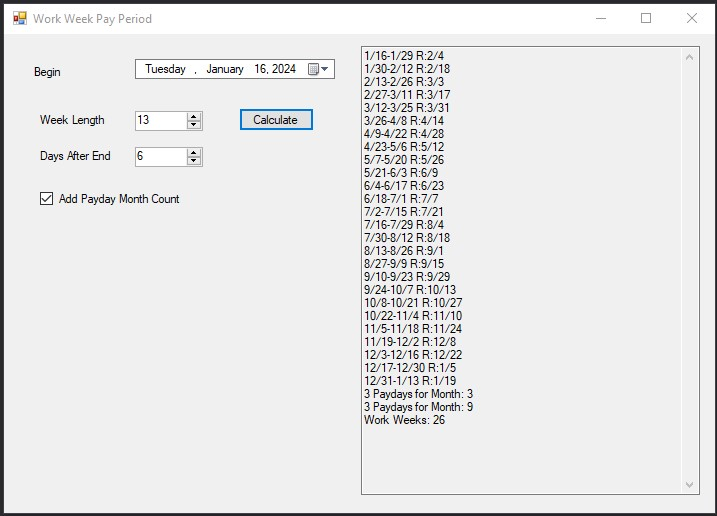

# PredictWorkDays
This helps create copy and paste text that can be used   
to place payment Dates into an excel spread sheet or detect days into an application

## Examples

## Built With
* Visual Studio 2017 Community
* Win forms 

## Author
Project Coded by - Bailey Heck

## License
This project is licensed under the MIT License.

## History
Made for my Excel spread sheet I use for my Finances,  
and help with my friends.

## Key Programming Concepts Utilized
I have utilized The Date Library and adding dates to  
create a predicion for future payment dates.

